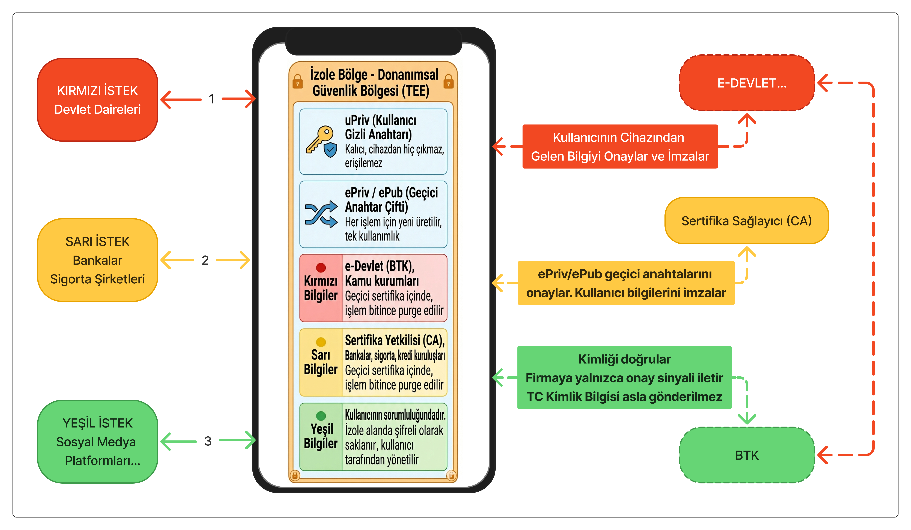

# Güvenli Kimlik Doğrulama Protokolü

**Hazırlayan:** Güven ACAR — İzmir, 2026  
**Kaynak:** https://github.com/guvenacar  

---

## Neden Bu Protokol?

Dijital dünyada kimlik doğrulama kaçınılmazdır. Bankaya giriş yaparken, sosyal medya hesabı açarken, devlet hizmetlerine erişirken kim olduğumuzu kanıtlamak zorundayız.

Ancak bugün kullanılan yöntemlerin ortak bir sorunu var:

> **Sizi doğrulayan kurum, sizi tanımak zorunda değil olduğu hâlde tanıyor. Ve bu bilgiyi üçüncü taraflarla paylaşıyor.**

"Google ile giriş yap" dediğinizde Google, girdiğiniz siteye sizi tanıtıyor. Kimliğiniz bir yerden bir yere akıyor. Bu akışı durdurmak mümkün — ve bu protokol tam olarak bunu yapıyor.

---

## Temel İlke

**Kimlik doğrulama ile kimlik ifşası birbirinden ayrılabilir.**

Bir kapıcı size "bu kişi güvenilirdir" diyebilir — ama adınızı, adresinizi, TC kimlik numaranızı karşı tarafa söylemek zorunda değildir.

Bu protokol bu ayrımı teknik bir garanti hâline getiriyor.

---

## Nasıl Çalışır?

### Temel Bileşenler

**uPriv (Kullanıcı Gizli Anahtarı)**  
Kullanıcının cihazında, donanımsal güvenlik bölgesinde (TEE) saklanır. Cihazdan hiçbir zaman çıkmaz. Kimsenin erişemediği, yalnızca kullanıcıya ait bir dijital mühürdür.

**ePriv / ePub (Geçici Anahtar Çifti)**  
Her işlem için sıfırdan üretilir, işlem tamamlandığında yok edilir. Tek kullanımlıktır. Kullanıcının gerçek kimliğiyle doğrudan bağlantısı yoktur.

**Donanımsal Güvenlik Bölgesi (TEE)**  
Kullanıcının telefonunun ya da bilgisayarının içinde, işletim sisteminden bile yalıtılmış güvenli bir alan. Bu alanda saklanan bilgilere dışarıdan erişilemez.

---

### Senaryo 1: Sosyal Medya Girişi (Yeşil İstek)

Kullanıcı Facebook, X veya benzer bir platforma giriş yapacaktır.

1. Platform, BTK'ya doğrulama talebinde bulunur.
2. BTK, eDevlet'e sorar: "Bu kullanıcı geçerli mi?"
3. eDevlet TC kimliğini görür ve "evet, geçerli" der.
4. BTK bu onayı imzalar — TC kimliğini görmez, elinden geçmez.
5. Platform yalnızca şunu alır: **"Bu kullanıcı doğrulandı."**

**Platform hiçbir zaman TC kimlik numarasını görmez.**  
**BTK hiçbir zaman TC kimlik numarasını görmez.**  
**Kimlik bilgisi yalnızca eDevlet'te kalır.**

---

### Senaryo 2: Bankacılık ve Sigorta (Sarı İstek)

Kullanıcı bir bankaya kredi başvurusu yapacak ya da sigorta şirketiyle sözleşme imzalayacaktır.

Akış Senaryo 1 ile aynıdır. Fark şudur: Sertifika Yetkilisi (CA) işleme dahil olur ve geçici sertifika oluşturulur. Bu sertifika işlem tamamlandığında otomatik olarak silinir.

**Banka, kullanıcının kimliğini doğrulamış olur — ama TC kimliğini hiç almamış olur.**

---

### Senaryo 3: Devlet Hizmetleri (Kırmızı İstek)

Kullanıcı e-Devlet üzerinden resmi bir işlem yapacaktır.

Bu senaryoda yalnızca kırmızı seviye kurumlar (devlet daireleri) TC kimliğine doğrudan erişebilir. Bu erişim protokol tarafından renk kodlarıyla katmanlara ayrılmıştır — sosyal medya platformları asla kırmızı seviyeye erişemez.

---

## Mevcut Sistemlerden Farkı

| | Mevcut Yöntemler | Bu Protokol |
|---|---|---|
| TC kimliği karşı tarafa gider mi? | Genellikle evet | **Asla** |
| Kimlik verisi üçüncü taraflarda birikir mi? | Evet | **Hayır** |
| Yasal baskıyla kimlik verilebilir mi? | Evet | **Teknik olarak imkânsız** |
| Kullanıcı kontrolü | Kısıtlı | **Tam** |
| Güvenlik garantisi | Politikaya bağlı | **Matematiksel** |

---

## Neden "Politikaya Bağlı" Değil "Matematiksel Garanti"?

Mevcut sistemlerde "kimliğinizi paylaşmıyoruz" bir vaattir. Yasalar değişebilir, hükümetler değişebilir, kurumlar baskıya boyun eğebilir.

Bu protokolde ise kimlik bilgisi BTK'nın elinden hiç geçmediği için, BTK istemesi durumunda bile Facebook'a TC kimliğini veremez.

**Vermemek değil, verememek. Bu fark her şeyi değiştirir.**

---

## Kullanıcı Açısından Ne Değişir?

Hiçbir şey. Kullanıcı her zamanki gibi giriş yapar. Arka planda bu protokol çalışır.

Değişen tek şey şudur: Artık bir siteye üye olduğunuzda o site sizi tanımıyor — sadece güvenilir olduğunuzu biliyor.

---

## Kimler Etkilenir?

**Vatandaşlar:** TC kimlik bilgileri yabancı şirketlerin sunucularına gitmez.

**Şirketler:** Kimlik verisi saklamak zorunda kalmazlar — saklayamadıkları için sızdıramazlar.

**Devlet:** Kimlik altyapısının kontrolü merkezde kalır, ancak bu kontrol vatandaşa zarar vermez.

**Yabancı platformlar:** Türk kullanıcıları doğrulayabilirler — ama onlar hakkında hiçbir şey öğrenemezler.

---

## Sonuç

Bu protokol yeni bir teknoloji icat etmiyor. Onlarca yıldır kanıtlanmış kriptografik yöntemleri, vatandaşın kimliğini koruyacak şekilde bir araya getiriyor.

Amaç basit:

> **Dijital dünyada kimliğinizi kanıtlayabilmelisiniz — ama bunun için kimliğinizi teslim etmek zorunda kalmamalısınız.**

---

*Teknik detaylar ve kriptografik spesifikasyon için teknik belgeye bakınız.*  
*https://github.com/guvenacar*
